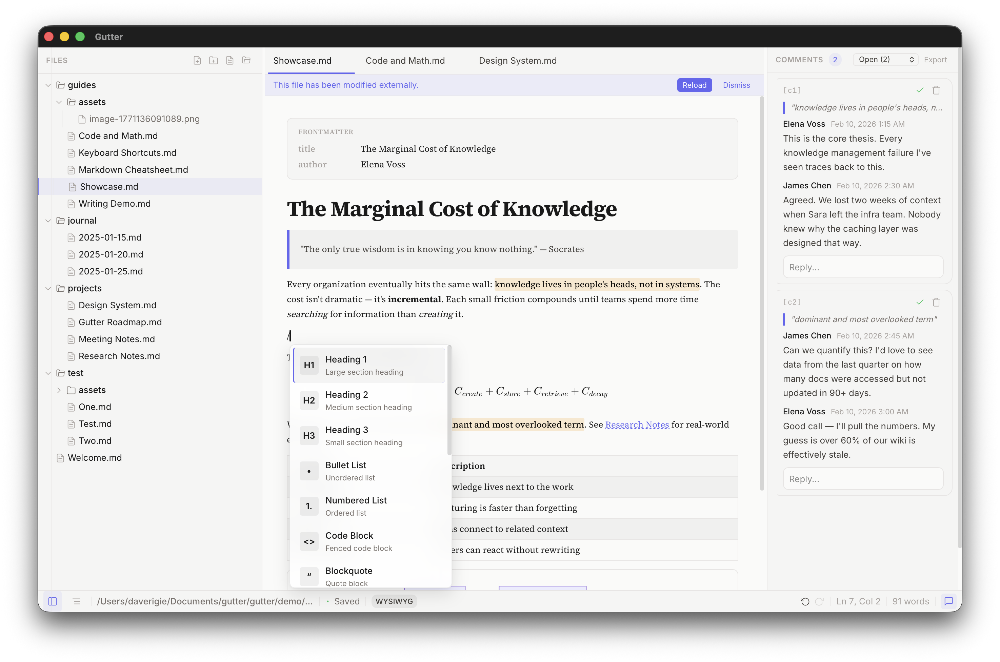

# Gutter

A local-first WYSIWYG markdown editor with first-class inline commenting. Built with Tauri v2, React 19, and TipTap 3.

**[Download](https://davidrigie.github.io/gutter/)** | **[Releases](https://github.com/davidrigie/gutter/releases)**



## Features

- **WYSIWYG Markdown** — headings, bold, italic, links, code blocks, tables, all rendered live
- **Inline Commenting** — highlight text and leave comments, stored as portable HTML markers in standard markdown
- **Wiki Links** — connect notes with `[[wiki links]]`, autocomplete, and backlinks
- **Math & Diagrams** — LaTeX equations (KaTeX) and Mermaid diagrams rendered inline
- **Local-First** — your files stay on your machine, plain markdown, no accounts or cloud
- **Fast & Native** — Rust backend, starts in under a second, minimal memory usage

## Download

Grab the latest build from the [releases page](https://github.com/davidrigie/gutter/releases) or the [website](https://davidrigie.github.io/gutter/):

- **macOS** — Apple Silicon (.dmg) and Intel (.dmg)
- **Windows** — Installer (.exe) and MSI
- **Linux** — AppImage and .deb

Builds are currently unsigned — your OS may show a warning on first launch.

## Development

```bash
cd gutter
npm install
npm run tauri dev
```

### Commands

```bash
npm run tauri dev          # Full app (Vite + Rust + native window)
npm run dev                # Frontend only (Vite on localhost:1421)
npm run build              # Production build
npm test                   # Run tests
npx tsc --noEmit           # Type check
```

## Stack

- **Frontend**: React 19 + TipTap 3 (ProseMirror) + Zustand + Tailwind
- **Backend**: Tauri v2 (Rust)
- **Extras**: KaTeX math, Mermaid diagrams, GFM support

## Comment System

Gutter's core differentiator — inline comment threads that live alongside your markdown:

- Highlighted text with comment markers survive standard markdown renderers
- Structured thread data in `.comments.json` sidecar files
- Auto-generated human-readable `.comments.md` companion

## Built With

This entire project — every line of Rust, React, CSS, and this README — was written by [Claude Code](https://claude.ai/code).

## License

MIT
