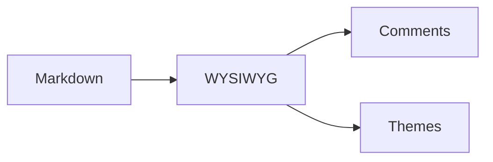

# Gutter

A local-first markdown editor with **bold**, *italic*, `code`, and <mark>inline comments</mark><sup>[c1]</sup>.

> "The best writing tool is the one that gets out of your way."

| Stack | Technology |
| --- | --- |
| Backend | Tauri v2 (Rust) |
| Frontend | React 19 |
| Editor | TipTap 3 |

```rust
fn main() {
    println!("Hello from Gutter!");
}
```

$$
\nabla \times \mathbf{E} = -\frac{\partial \mathbf{B}}{\partial t}
$$



/
