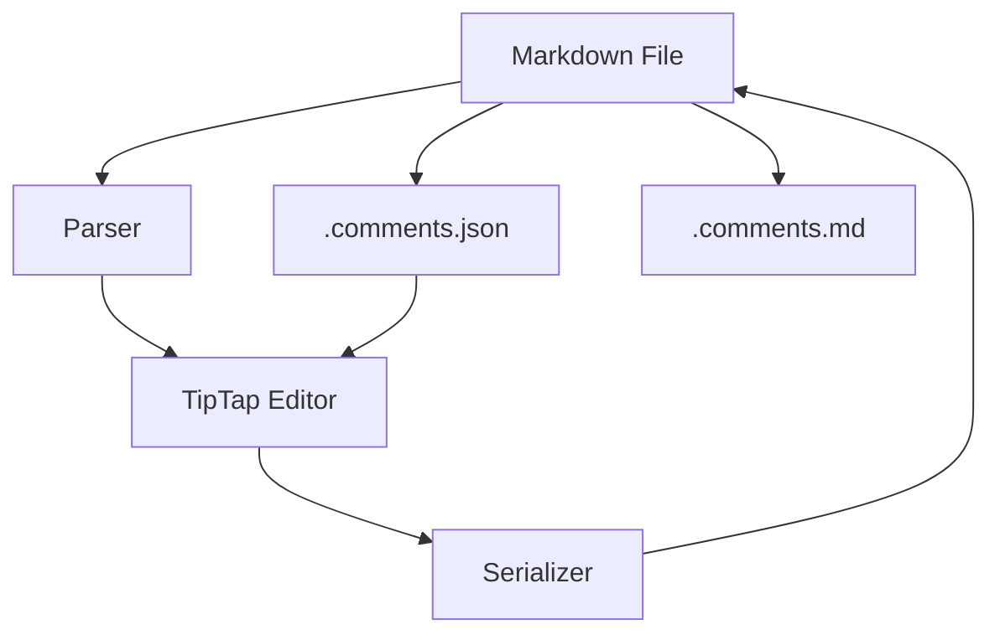
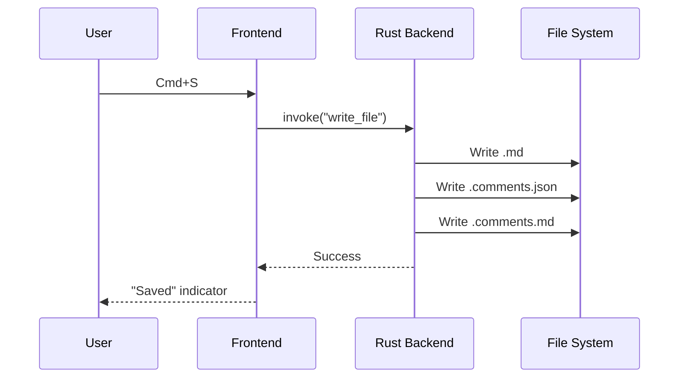

# Code and Math

Gutter supports syntax-highlighted code blocks, LaTeX math, and Mermaid diagrams.

## Code Blocks

### Rust

```rust
use std::collections::HashMap;

fn word_count(text: &str) -> HashMap<&str, usize> {
    let mut counts = HashMap::new();
    for word in text.split_whitespace() {
        *counts.entry(word).or_insert(0) += 1;
    }
    counts
}
```

### TypeScript

```typescript
interface Comment {
  id: string;
  author: string;
  body: string;
  timestamp: Date;
}

function createThread(comment: Comment): Thread {
  return {
    comments: [comment],
    resolved: false,
    createdAt: comment.timestamp,
  };
}
```

### Python

```python
def fibonacci(n: int) -> list[int]:
    """Generate the first n Fibonacci numbers."""
    if n <= 0:
        return []
    fib = [0, 1]
    for _ in range(2, n):
        fib.append(fib[-1] + fib[-2])
    return fib[:n]
```

## Mathematics

Inline math: The quadratic formula is $x = \frac{-b \pm \sqrt{b^2 - 4ac}}{2a}$.

### Block Math

Maxwell's equations in differential form:

$$
\nabla \cdot \mathbf{E} = \frac{\rho}{\varepsilon_0}
$$

$$
\nabla \cdot \mathbf{B} = 0
$$

$$
\nabla \times \mathbf{E} = -\frac{\partial \mathbf{B}}{\partial t}
$$

$$
\nabla \times \mathbf{B} = \mu_0 \mathbf{J} + \mu_0 \varepsilon_0 \frac{\partial \mathbf{E}}{\partial t}
$$

Euler's identity: $e^{i\pi} + 1 = 0$

## Mermaid Diagrams

### Architecture



### Sequence Diagram



See also: [[Writing Demo]] for text formatting, [[Welcome]] for shortcuts.'


