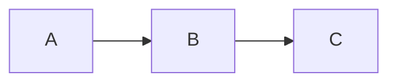

# Markdown Cheatsheet

A quick reference for markdown syntax supported in Gutter.

## Inline Formatting

| Syntax | Result |
| --- | --- |
| `**bold**` | **bold** |
| `*italic*` | *italic* |
| `~~strike~~` | ~~strike~~ |
| `code` | `code` |
| `[link](url)` | [link](https://example.com) |
| `[[Wiki Link]]` | [[Welcome]] |

## Block Elements

### Headings

```
# Heading 1
## Heading 2
### Heading 3
```

### Lists

```
- Bullet item
  - Nested item

1. Numbered item
2. Second item
```

### Code Block

Use triple backticks with an optional language:

```
```python
print("hello")
```

```
### Math

Inline: `$E = mc^2$` renders as $E = mc^2$

Block:
```

MATH_BLOCK_0

```
### Mermaid Diagrams
```



```
## Blockquotes

```

> This is a blockquote
> 
> It can span multiple lines

```

> This is a blockquote
>
> It can span multiple lines

## Gutter-Specific

### Comments

Select text and press `Cmd+Shift+M` to add a comment. Comments are stored as:

```html
<mark>highlighted text</mark><sup>[c1]</sup>
```

### Frontmatter

```yaml
---
title: My Document
tags: [tag1, tag2]
---
```

See [[Welcome]] for keyboard shortcuts.
