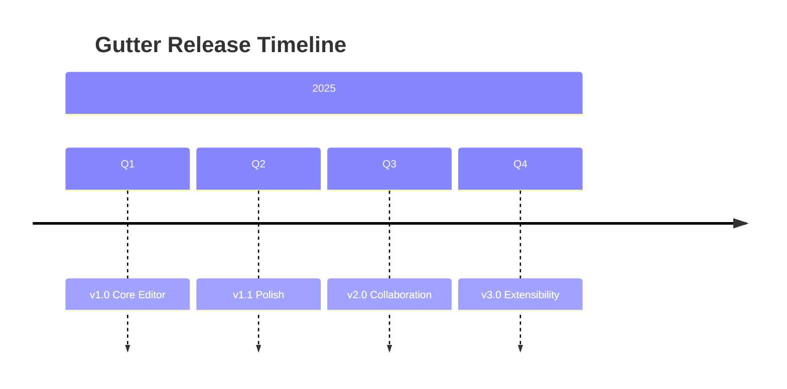

# Gutter Roadmap

Tracking upcoming features and milestones for the Gutter editor.

## v1.0 — Core Editor (Shipped)

- WYSIWYG markdown editing with TipTap
- Three-file comment model
- File tree with workspace support
- Multi-tab editing
- Syntax-highlighted code blocks
- LaTeX math rendering
- Mermaid diagrams
- Light and dark themes
- Find & replace
- Version history
- Wiki links with backlinks

## v1.1 — Polish

- Custom themes and font settings
- Drag & drop file reordering
- Improved table editing
- Image resizing
- PDF export

## v2.0 — Collaboration

- Real-time sync via CRDTs (see [[Research Notes]])
- Collaborative cursors
- Comment @mentions
- Change tracking

## v3.0 — Extensibility

- Plugin API
- Custom slash commands
- Template system
- API integrations

## Architecture Decisions

See [[Meeting Notes]] for <mark>discussion</mark>[c1] context.[[2025-01-25]]

