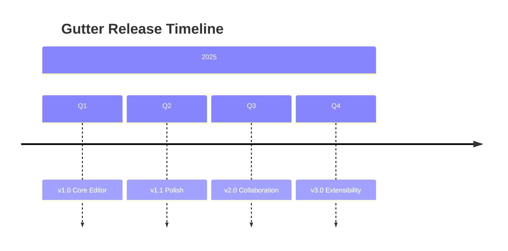

# Gutter Roadmap

Tracking upcoming features and milestones for the Gutter editor.

## v1.0 — Core Editor (Shipped)

- [x] WYSIWYG markdown editing with TipTap
- [x] Three-file comment model
- [x] File tree with workspace support
- [x] Multi-tab editing
- [x] Syntax-highlighted code blocks
- [x] LaTeX math rendering
- [x] Mermaid diagrams
- [x] Light and dark themes
- [x] Find & replace
- [x] Version history
- [x] Wiki links with backlinks

## v1.1 — Polish

- [ ] Custom themes and font settings
- [ ] Drag & drop file reordering
- [ ] Improved table editing
- [ ] Image resizing
- [ ] PDF export

## v2.0 — Collaboration

- [ ] Real-time sync via CRDTs (see [[Research Notes]])
- [ ] Collaborative cursors
- [ ] Comment @mentions
- [ ] Change tracking

## v3.0 — Extensibility

- [ ] Plugin API
- [ ] Custom slash commands
- [ ] Template system
- [ ] API integrations

## Architecture Decisions

See [[Meeting Notes]] for discussion context.

