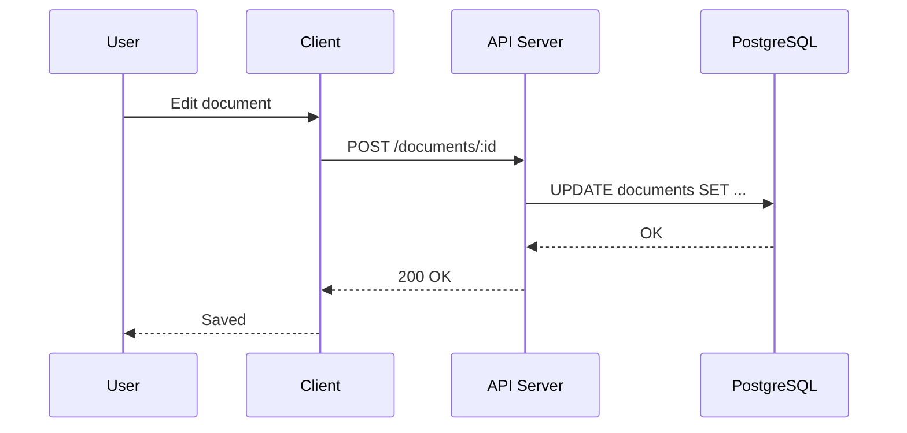
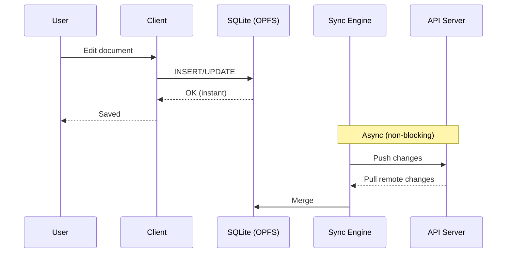
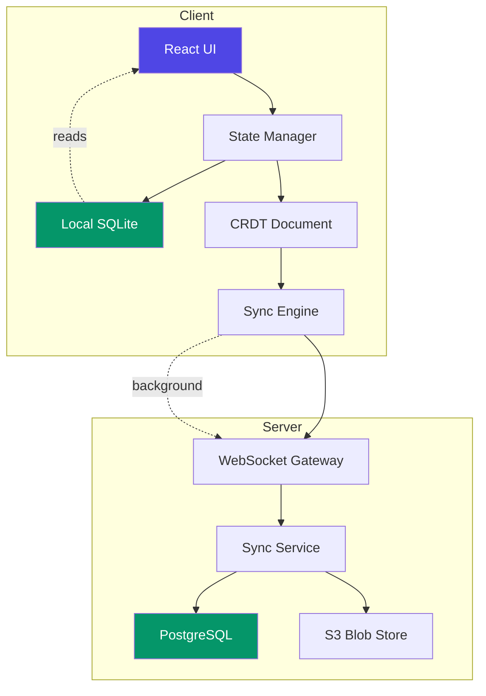
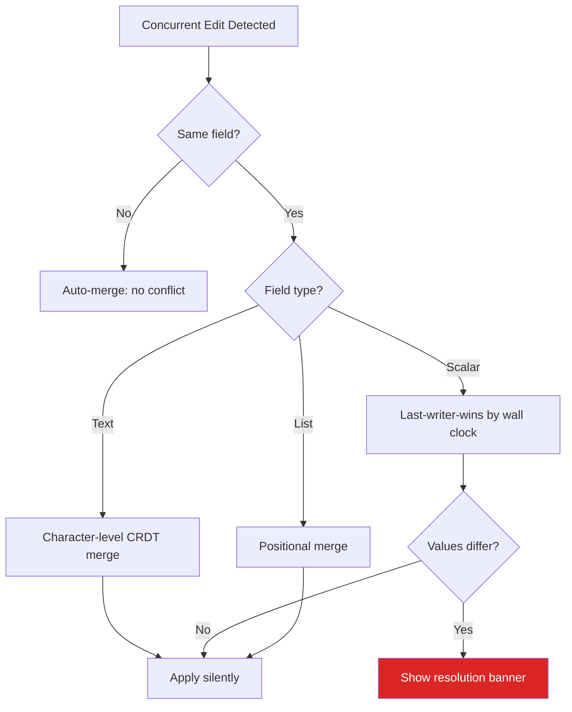
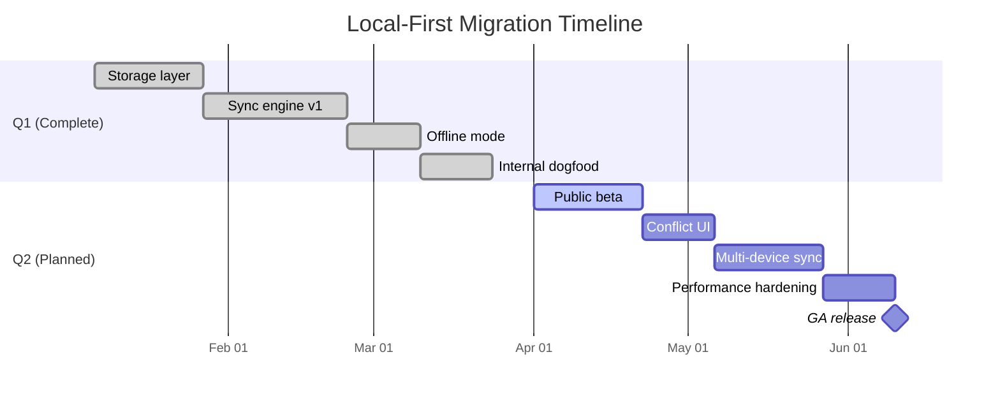

# Q1 2025 Engineering Review

## Local-First Architecture Migration

> "We don't have a latency problem. We have a *dependency* problem — every feature we build assumes the server is reachable." — James Okafor, Principal Engineer, January Retrospective

This document summarizes the engineering team's progress on migrating Helios from a cloud-first to a <mark>local-first architecture</mark><sup>[c1]</sup> during Q1 2025. It covers technical decisions, performance benchmarks, open risks, and the roadmap for Q2.

---

## Executive Summary

Over the past quarter, we shipped three major milestones:

1. **Client-side storage layer** — SQLite via `wa-sqlite` with OPFS backend
2. **Sync engine v1** — CRDT-based replication using Automerge
3. **Offline mode** — full read/write capability without network access

Key metrics improved across the board. Median document load time dropped from 1,340ms to 38ms — a **97.2% reduction**. P99 sync latency for collaborative edits is under 200ms on typical home connections.

The remaining work is scoped to Q2 and tracked in the [[Gutter Roadmap]].

---

## 1. Architecture Overview

### 1.1 Before: Cloud-First Model

Every user action required a round-trip to our API:



This created a hard dependency on network availability. Our incident log shows **14 outages** in 2024 where users lost work due to failed writes during server downtime.

### 1.2 After: Local-First Model

Writes go to a local database first, then sync asynchronously:



The user sees a save confirmation in **under 5ms** regardless of network conditions. Conflict resolution happens in the background via CRDTs.

### 1.3 System Components



---

## 2. Technical Decisions

### 2.1 Storage: SQLite over IndexedDB

We evaluated three client-side storage options. SQLite via OPFS won decisively:

| Criteria | IndexedDB | SQLite (OPFS) | PGlite |
| --- | --- | --- | --- |
| Query flexibility | Low (key-value) | High (full SQL) | High (full SQL) |
| Write throughput | ~2,000 ops/s | ~18,000 ops/s | ~8,000 ops/s |
| Bundle size | 0 KB (native) | 420 KB (WASM) | 3.2 MB (WASM) |
| Transaction support | Limited | Full ACID | Full ACID |
| Migration tooling | Manual | Knex/Drizzle | Drizzle |
| Browser support | Universal | Chrome 102+, Firefox 111+ | Chrome 102+ |

The write throughput difference is <mark>especially significant for our sync engine</mark><sup>[c2]</sup>, which batches incoming remote changes and applies them in bulk transactions.

**Schema excerpt** for the documents table:

```sql
CREATE TABLE documents (
    id          TEXT PRIMARY KEY,
    workspace   TEXT NOT NULL,
    title       TEXT NOT NULL,
    content     BLOB NOT NULL,        -- Automerge binary
    local_seq   INTEGER DEFAULT 0,    -- local change counter
    remote_seq  INTEGER DEFAULT 0,    -- last synced server seq
    updated_at  TEXT DEFAULT (datetime('now')),
    UNIQUE(workspace, title)
);

CREATE INDEX idx_docs_workspace ON documents(workspace);
CREATE INDEX idx_docs_updated ON documents(updated_at DESC);
```

### 2.2 Sync: Automerge over Yjs

Both libraries solve the same fundamental problem — merging concurrent edits without a central coordinator. The merge semantics can be expressed as:

$$
\text{merge}(D_A, D_B) = D_A \cup D_B \setminus \text{conflicts}(D_A \cap D_B)
$$

Where conflicts are resolved by a deterministic <mark>last-writer-wins register</mark><sup>[c3]</sup> at the field level, with vector clocks providing causal ordering:

$$
V_i[j] = \begin{cases}
V_i[j] + 1 & \text{if } i = j \\
\max(V_i[j], V_k[j]) & \text{on merge with } V_k
\end{cases}
$$

We chose Automerge for three reasons:

1. **Rust-native** — compiles to both our server (native) and client (WASM) from one codebase
2. **Binary format** — Automerge's columnar encoding is 3–8x smaller than Yjs for structured documents
3. **Rich text support** — the Peritext algorithm handles formatting spans correctly, which Yjs struggles with at mark boundaries

```rust
use automerge::{AutoCommit, ObjType, ROOT};

fn create_document(title: &str) -> AutoCommit {
    let mut doc = AutoCommit::new();
    doc.put(ROOT, "title", title).unwrap();
    doc.put(ROOT, "version", 1_u64).unwrap();

    let content = doc.put_object(ROOT, "content", ObjType::Text).unwrap();
    doc.splice_text(&content, 0, 0, "").unwrap();

    let meta = doc.put_object(ROOT, "metadata", ObjType::Map).unwrap();
    doc.put(&meta, "created_at", chrono::Utc::now().to_rfc3339()).unwrap();
    doc.put(&meta, "word_count", 0_u64).unwrap();

    doc
}
```

### 2.3 Conflict Resolution Strategy

Not all conflicts are equal. We use a tiered approach:



In practice, true conflicts (the red path) occur in fewer than **0.3%** of sync operations, because most collaboration is either turn-based or on different sections of a document.

---

## 3. Performance

### 3.1 Load Time Benchmarks

All measurements taken on an M2 MacBook Air, Chrome 122, with a 500-document workspace.

| Operation | Cloud-First (P50) | Local-First (P50) | Improvement |
| --- | --- | --- | --- |
| Document open | 1,340 ms | 38 ms | 97.2% |
| File tree render | 890 ms | 12 ms | 98.7% |
| Full-text search | 2,100 ms | 145 ms | 93.1% |
| Save to disk | 420 ms | 4 ms | 99.0% |
| Sync (per change) | N/A | 85 ms | — |

### 3.2 Storage Efficiency

The Automerge binary format is compact but not free. We measured the <mark>storage overhead</mark><sup>[c4]</sup> relative to plain markdown:

$$
\text{overhead}(d) = \frac{S_{\text{crdt}}(d) - S_{\text{md}}(d)}{S_{\text{md}}(d)} \times 100\%
$$

| Document size (markdown) | CRDT size | Overhead |
| --- | --- | --- |
| 1 KB | 2.8 KB | 180% |
| 10 KB | 18 KB | 80% |
| 100 KB | 140 KB | 40% |
| 1 MB | 1.3 MB | 30% |

Overhead decreases with document size because the fixed CRDT metadata (actor IDs, vector clocks) is amortized. For our median document size of 12 KB, the ~80% overhead adds roughly 10 KB — acceptable given that the entire workspace still fits comfortably in OPFS storage (2 GB quota on Chrome).

### 3.3 Bandwidth

Sync traffic follows a logarithmic pattern relative to edit rate:

$$
B(r) = B_0 + k \cdot \ln(1 + r)
$$

Where $r$ is the edit rate (changes/minute), $B_0$ is the baseline keepalive cost (~200 bytes/min), and $k$ is a compression-dependent constant. In practice, active editing generates **2–8 KB/minute** of sync traffic — negligible on any modern connection.

---

## 4. Migration Plan

### 4.1 Phased Rollout



### 4.2 Data Migration

Existing users need their cloud documents migrated to the local store. The migration script handles this in three passes:

```typescript
async function migrateWorkspace(userId: string): Promise<MigrationResult> {
  const stats = { migrated: 0, skipped: 0, failed: 0 };

  // Pass 1: Fetch all documents from the API
  const docs = await fetchAllDocuments(userId);

  // Pass 2: Convert to Automerge and write locally
  for (const doc of docs) {
    try {
      const crdt = AutomergeDocument.from({
        title: doc.title,
        content: doc.content,
        metadata: {
          createdAt: doc.createdAt,
          migratedAt: new Date().toISOString(),
          sourceVersion: doc.version,
        },
      });

      await localDb.exec(
        `INSERT INTO documents (id, workspace, title, content)
         VALUES (?, ?, ?, ?)`,
        [doc.id, doc.workspace, doc.title, crdt.save()]
      );

      stats.migrated++;
    } catch (err) {
      console.error(`Failed to migrate ${doc.id}:`, err);
      stats.failed++;
    }
  }

  // Pass 3: Verify round-trip integrity
  for (const doc of docs) {
    const local = await localDb.get(`SELECT content FROM documents WHERE id = ?`, [doc.id]);
    const restored = AutomergeDocument.load(local.content);
    if (restored.text !== doc.content) {
      console.warn(`Round-trip mismatch for ${doc.id}`);
      stats.skipped++;
    }
  }

  return stats;
}
```

---

## 5. Risks and Mitigations

### 5.1 Open Risks

| Risk | Severity | Likelihood | Mitigation |
| --- | --- | --- | --- |
| OPFS quota exceeded on large workspaces | High | Low | Implement LRU eviction for inactive docs |
| Automerge WASM bundle size regresses | Medium | Medium | Tree-shake unused modules, track size in CI |
| Clock skew causes incorrect LWW resolution | Medium | Low | Use hybrid logical clocks instead of wall time |
| Safari OPFS support remains experimental | High | Medium | Maintain IndexedDB fallback path |
| Sync conflicts confuse non-technical users | Medium | High | <mark>Design a clear conflict resolution UI</mark><sup>[c5]</sup> |

### 5.2 Security Considerations

Local-first introduces new threat vectors:

- **Data at rest** — OPFS is not encrypted by default. We use the Web Crypto API to encrypt document content with a key derived from the user's passphrase:

$$
K = \text{PBKDF2}(\text{passphrase}, \text{salt}, 100000, 256)
$$

- **Sync channel** — All WebSocket traffic is encrypted via TLS. Message-level encryption (double ratchet) is planned for Q3.
- **Device loss** — Recovery requires the passphrase plus the server-side encrypted backup. We cannot recover data for users who lose both.

---

## 6. Q2 Roadmap

### 6.1 Priorities

- [ ] Ship public beta (April 1 target)
- [ ] Build conflict resolution UI with inline diff view
- [ ] Add multi-device sync with device management panel
- [ ] Implement workspace sharing (read-only links first)
- [ ] Write user-facing documentation for offline mode
- [ ] Performance hardening: reduce WASM init time from 180ms to under 50ms


### 6.2 Stretch Goals

- [ ] End-to-end encryption for shared workspaces
- [ ] Mobile companion app (read-only, React Native)
- [ ] Plugin API for custom sync backends

### 6.3 Success Criteria

The migration is successful when all of the following hold:

1. **Reliability**: Zero data loss incidents in production for 30 consecutive days
2. **Performance**: P99 document open time under 100ms
3. **Adoption**: 80% of weekly active users have local-first enabled
4. **Satisfaction**: NPS score for editing experience improves by 15+ points

$$
\text{Success} = \prod_{i=1}^{4} \mathbb{1}[\text{criterion}_i \text{ met}]
$$

---

## 7. Appendix

### A. Glossary

| Term | Definition |
| --- | --- |
| **CRDT** | Conflict-free Replicated Data Type — a data structure that can be merged without coordination |
| **OPFS** | Origin Private File System — a browser API for fast, private file storage |
| **LWW** | Last Writer Wins — a conflict resolution strategy where the most recent write takes precedence |
| **Vector clock** | A logical clock that tracks causal ordering across distributed nodes |
| **Peritext** | An algorithm for correctly merging rich text formatting in CRDTs |

### B. References

- Martin Kleppmann et al., *[Local-First Software](https://www.inkandswitch.com/local-first/)* (Ink & Switch, 2019)
- Automerge documentation: [automerge.org](https://automerge.org)
- Seph Gentle, *[Diamond Types](https://github.com/josephg/diamond-types)* — high-performance Rust CRDT
- See also [[Research Notes]] for our original CRDT evaluation and [[Design System]] for the conflict resolution UI design tokens

### C. Team

| Name | Role | Focus Area |
| --- | --- | --- |
| Sarah Chen | Tech Lead | Architecture, sync engine |
| James Okafor | Principal Engineer | Storage layer, performance |
| Maya Patel | Senior Engineer | Migration tooling, testing |
| Tomás Rivera | Engineer | Conflict resolution UI |
| Ava Kim | Designer | Offline UX, sync indicators |

---

*Last updated March 28, 2025. Next review scheduled for June 30, 2025.*
